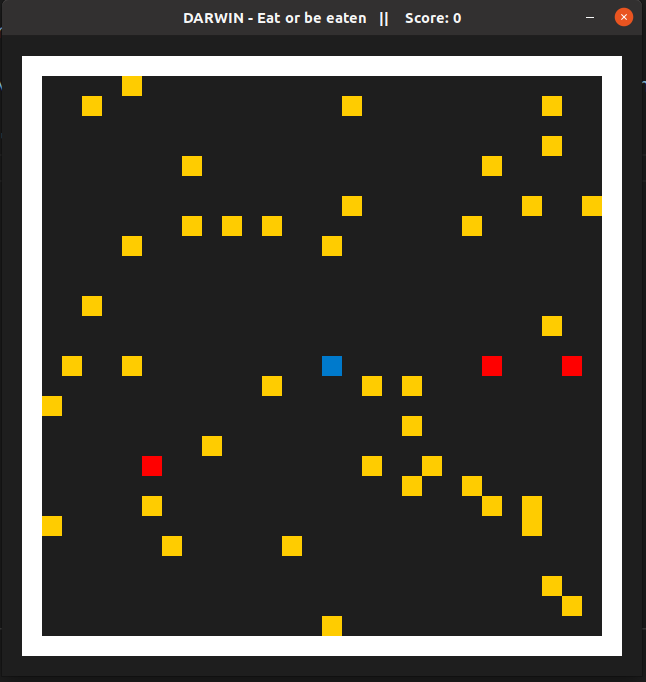

# DARWIN - Eat or be eaten! A single cell survival game

This game was created as part of the Capstone project of the [Udacity C++ Nanodegree Program](https://www.udacity.com/course/c-plus-plus-nanodegree--nd213) and is based on the "Snake" starter repo example (see: https://github.com/udacity/CppND-Capstone-Snake-Game)

## How to Play
It's a lovely day at the hydrothermal vent. Blue is especially happy today! Right above a nice little fissure in the sea floor, he found an abundant supply of his favorite food: Yellow! Tasty, squishy, only partially slimy yellow! But Blue has to be careful. The lower fissures around the main vent are the hunting ground of the vicious Reds who like nothing better than the taste of fresh Blue! Sure, they're somewhat slow at first, but don't give them the chance to boost their metabolism on too much yellow.
Your task is to help Blue eat his fill without becoming a tasty little snack himself.

Use the arrow keys to move the blue cursor.
The game ends if either no more food is available (Victory) or the player gets eaten by the red amoebae.
You can pause/unpause the game at any time by pressing the "P" key.

Once the game ends, you have to restart the application to continue.

## Customizing Game Experience
The game can be customized by changing the constant expressions in file "main.cpp"
Note that the program has to be rebuild before any changes take effect.

Parameters that can be changed include size and resolution of the grid, number of spawned food and predators as well as initial predator speed.

## Project Description: Files, Class Structure and Expected Output
TBD

## Satisfaction of Rubric Points
(https://review.udacity.com/#!/rubrics/2533/view)
TBD

## Dependencies for Running Locally
* cmake >= 3.7
  * All OSes: [click here for installation instructions](https://cmake.org/install/)
* make >= 4.1 (Linux, Mac), 3.81 (Windows)
  * Linux: make is installed by default on most Linux distros
  * Mac: [install Xcode command line tools to get make](https://developer.apple.com/xcode/features/)
  * Windows: [Click here for installation instructions](http://gnuwin32.sourceforge.net/packages/make.htm)
* SDL2 >= 2.0
  * All installation instructions can be found [here](https://wiki.libsdl.org/Installation)
  >Note that for Linux, an `apt` or `apt-get` installation is preferred to building from source. 
* gcc/g++ >= 5.4
  * Linux: gcc / g++ is installed by default on most Linux distros
  * Mac: same deal as make - [install Xcode command line tools](https://developer.apple.com/xcode/features/)
  * Windows: recommend using [MinGW](http://www.mingw.org/)

## Basic Build Instructions

1. Clone this repo.
2. Make a build directory in the top level directory: `mkdir build && cd build`
3. Compile: `cmake .. && make`
4. Run it: `./Darwin`.

## CC Attribution-ShareAlike 4.0 International

Shield: [![CC BY-SA 4.0][cc-by-sa-shield]][cc-by-sa]

This work is licensed under a
[Creative Commons Attribution-ShareAlike 4.0 International License][cc-by-sa].

[![CC BY-SA 4.0][cc-by-sa-image]][cc-by-sa]

[cc-by-sa]: http://creativecommons.org/licenses/by-sa/4.0/
[cc-by-sa-image]: https://licensebuttons.net/l/by-sa/4.0/88x31.png
[cc-by-sa-shield]: https://img.shields.io/badge/License-CC%20BY--SA%204.0-lightgrey.svg
